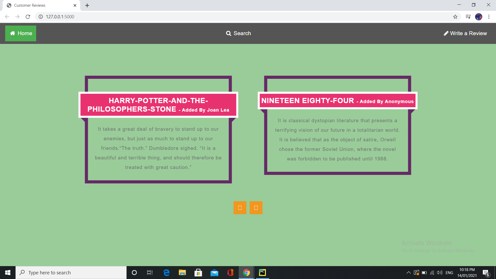
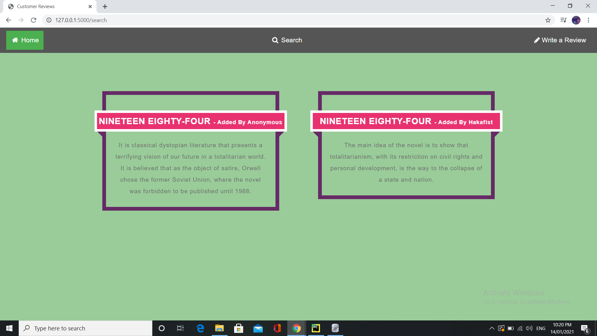
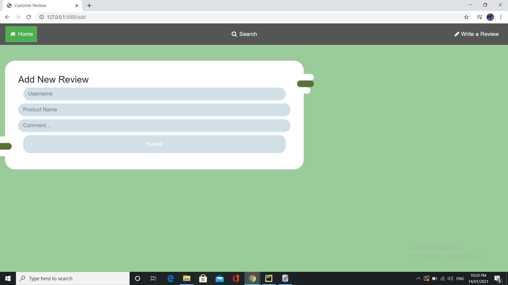

# Customer-Review-Web-App

##### Technology Stack
Frontend: HTML, CSS, Javascript, Bootstrap, Jinja2 \
Backend: Python, Flask,Sqlite, SQLAlchemy

##### Dashboard

##### Search for Products
Users can search for products on the homepage or from the navbar. When the user clicks Search, the input from the form is passed to the sqlite database. The database performs an efficient search, handling case and returning the most relevant products.

##### Write a Reviews for Product
Users can write a review for products on the homepage or from the navbar. When the user clicks write, the input from the form is passed to the sqlite database. 

